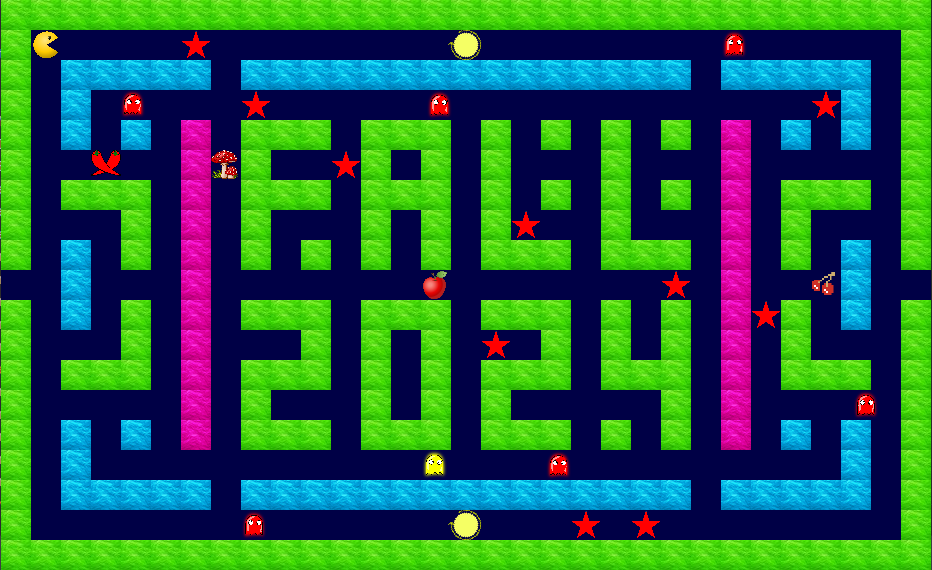

# Pac-Man – Mini Game (C with Raylib)

A simple Pac-Man game developed in C using the Raylib graphics library.

## Features

- Sound effects
- Top 10 high scores display
- Replay system (watch your last game)

## Screenshots

### 🔹 Main Menu
  
### 🔹 Setting
  

### 🔹 Gameplay

### 🔹 Game Over
   

### 🔹 Replay
   

### 🔹 Top Scores
  

## 🚀 How to Run

   ....
